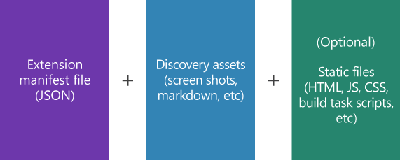

# Multi Widget Azure DevOps Marketplace Extension

[Azure DevOps](https://dev.azure.com) is a great tool, it's feature-rich, it might fits all of your needs to have a _code repository_, _project management tools_, _sharing facilities_, _pipelines_, etc.

_Did I mention it's free? 😀_

Still, you may need extra functionality. Luckily, [Azure DevOps Marketplace](https://marketplace.visualstudio.com/azuredevops) has tons of extensions, I'm sure you can find an extension suits for your needs.

If you need _tailored_ extension for your needs, you're not alone. [Microsoft](https://microsoft.com) has [Extension Framework](https://docs.microsoft.com/en-us/azure/devops/extend/overview?view=azure-devops) to help you handcraft your _own_ extension and push it to [Azure DevOps Marketplace](https://marketplace.visualstudio.com/azuredevops).

Maybe, others will find, install, benefit and enjoy _your_ extension 😀

## Extension development checklist

* Extension manifest (_JSON_ file)
* Static files (_HTML_, _Javascript_, _CSS_ files)
* Logo (_PNG_ or _JPEG_ file)
* Publisher Account
* TFS Cross Platform Command Line Interface (_[tfx-cli](https://www.npmjs.com/package/tfx-cli)_) tool to package static files and produce _.vsix_ file



## Creating a Publisher Account

Sign-in to [Visual Studio Marketplace Publishing Portal](https://marketplace.visualstudio.com/manage/createpublisher)

Fill the form to create publisher

Review [Marketplace Publisher Agreement](https://aka.ms/vsmarketplace-agreement)

Click _Create_ button

## Installing TFS Cross Platform Command Line Interface (_tfx-cli_)

Since [tfx-cli]((https://www.npmjs.com/package/tfx-cli)) is an _NPM_ package, you need to install [Node](http://nodejs.org/) first

It's good to install the tool globally, because probably you'll need it for many extension projects.

```bash
npm i -g tfx-cli
```

## Creating Extension Manifest

Start by creating a file named [vss-extension.json](./src/vss-extension.json)

This _json_ file will include required attributes, such as, _Extension ID_, _Name_, _Publisher_, etc.

> There is a very good [Extension Manifest Reference](https://docs.microsoft.com/en-us/azure/devops/extend/develop/manifest?view=azure-devops) documentation for creating a detailed _Extension Manifest_. I highly recommend to read it first

Most important part of _Extension Manifest_ for this project is, *Contributions*

Because a _Contribution_ is, _basically_ a _widget_, you can drag-and-drop and resize it in an [Azure DevOps Dashboard](https://docs.microsoft.com/en-us/azure/devops/report/dashboards/dashboards?view=azure-devops).

```json
{
  "id": "SimpleWidget",
  "type": "ms.vss-dashboards-web.widget",
  "targets": [
    "ms.vss-dashboards-web.widget-catalog"
  ],
  "properties": {
    "name": "SimpleWidget",
    "description": "Lisbon DevOps - Simple Widget",
    "uri": "./simple-widget.html",
    "catalogIconUrl": "./logo.png",
    "previewImageUrl": "./logo.png",
    "supportedSizes": [
      {
        "rowSpan": 1,
        "columnSpan": 2
      }
    ],
    "supportedScopes": ["project_team"]
  }
}
```

## Creating static files

In this project, we grouped static files in [widgets](./src/widgets) folder.

We have, _Simple Widget_ ([html](./src/widgets/simple-widget.html), [typescript](./src/widget/simple-widget.ts)) and _Complex Widget_ ([html](./src/widgets/complex-widget.html), [typescript](./src/widget/complex-widget.ts), [scss](./src/widgets/complex-widget.scss))

Simple Widget only has _simple_ elements on screen, but Complex Widget has a dial chart.

I also add a [PowerShell](./build-serve-deploy.ps1) and [Bash](./build-serve-deploy.sh) script files, to make it easier to clean, build, serve and deploy the project.

After cloning this repository, you can execute following commands in your favorite Terminal (my favorite is [Microsoft Terminal](https://github.com/microsoft/terminal) 😀

```bash
# remove ./dist folder
./build-serve-deploy.sh --clean

# build project and produce ./dist folder
./build-serve-deploy.sh --build

# run local http server in ./dist folder to debug
./build-serve-deploy.sh --serve

# package everthing in ./dist folder and produce .vsix file
./build-serve-deploy.sh --deploy
```

## References

* [Developing extension for Azure DevOps](https://docs.microsoft.com/en-us/azure/devops/extend/overview?view=azure-devops)
* [Extension Manifest Reference](https://docs.microsoft.com/en-us/azure/devops/extend/develop/manifest?view=azure-devops)
* [Azure DevOps Extension SDK](https://developer.microsoft.com/en-us/azure-devops/develop/extensions)
* [Develop a web extension for Azure DevOps Services](https://docs.microsoft.com/en-us/azure/devops/extend/get-started/node?view=azure-devops)
* [Package, publish, unpublish, and install Azure DevOps Services extensions](https://docs.microsoft.com/en-us/azure/devops/extend/publish/overview?view=azure-devops)
* [Sample Extensions](https://github.com/microsoft/vsts-extension-samples)
* [Pure CSS Percentage Circle](http://circle.firchow.net/)

> I learned creating and publishing an extension to Azure DevOps Marketplace by doing it. I had a chance to work with brilliant people in an internal hack in Microsoft, many kudos to, _Todd Venhaus_, _Oliver Scheer_, _Ian Chen_, _Dariusz Porowski_. They helped me a lot to understand the steps and fine-tune the code.
